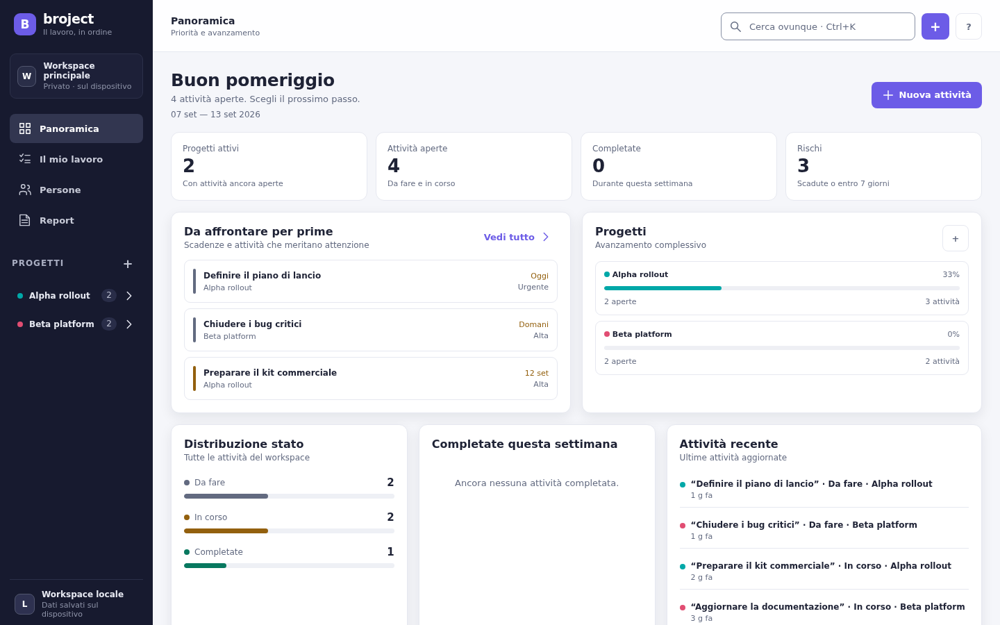
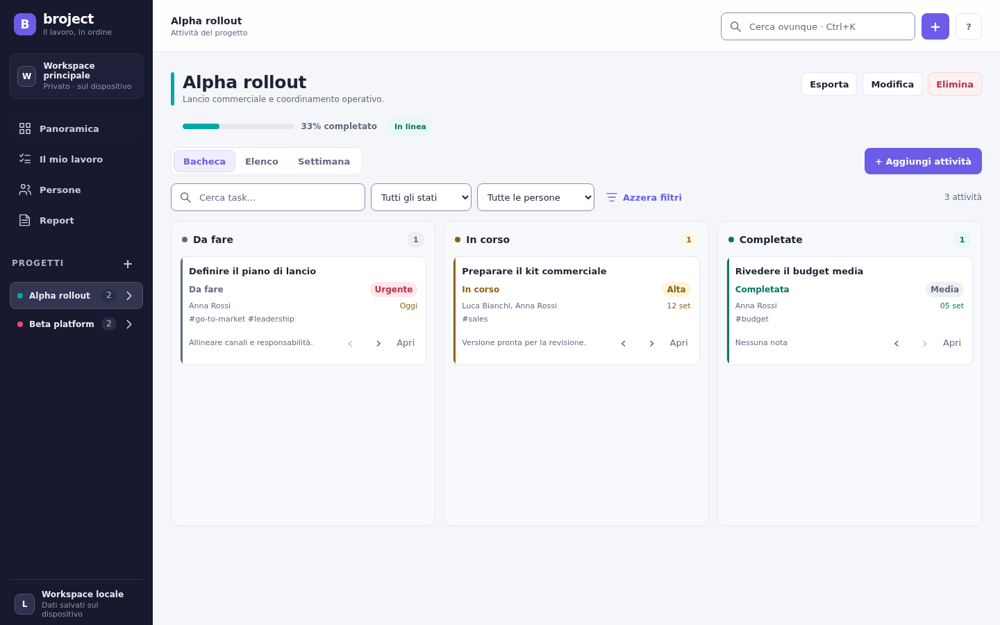

# Broject

**Il lavoro, finalmente chiaro.**

Broject è un’app desktop local-first per organizzare progetti, attività e persone in un workspace semplice da consultare. Riunisce pianificazione, stato di avanzamento, scadenze, carico di lavoro e report Excel in un’unica interfaccia, senza richiedere un account o un servizio cloud.

Questa cartella contiene la versione multipiattaforma di Broject, realizzata con Tauri 2. La versione WPF originale resta separata nel progetto padre.

## A cosa serve

Broject è pensato per chi vuole:

- avere una vista immediata di ciò che è urgente, in corso e completato;
- seguire più progetti senza perdere il contesto;
- assegnare attività a persone e capire dove si concentra il lavoro;
- lavorare offline, mantenendo i dati sul proprio computer;
- esportare un riepilogo professionale e modificabile in Excel o LibreOffice.

È adatto a un uso personale, a piccoli team che condividono report e a chi preferisce un archivio locale rispetto a una piattaforma SaaS. Non è un servizio collaborativo online: non include sincronizzazione cloud, login o aggiornamenti in tempo reale tra dispositivi.

## Cosa puoi fare

### Organizzare i progetti

Ogni progetto ha un nome, una descrizione, un colore e il proprio spazio di lavoro. Dalla sidebar puoi passare rapidamente da un progetto all’altro e vedere il numero di attività ancora aperte.

Nel dettaglio del progetto puoi usare tre viste:

- **Bacheca** — attività divise in *Da fare*, *In corso* e *Completate*;
- **Elenco** — tabella compatta con stato, persone, priorità e scadenza;
- **Settimana** — calendario settimanale per leggere il carico sulle singole giornate.

Le attività possono contenere titolo, note, conclusioni, tag, priorità, stato, una o più persone assegnate e una scadenza. Possono essere filtrate per stato o persona, cercate nel progetto e spostate tra le colonne della bacheca.

### Vedere cosa richiede attenzione

La **Panoramica** raccoglie le informazioni più utili senza obbligarti ad aprire ogni progetto:

- KPI del workspace;
- attività ad alta priorità, urgenti o prossime alla scadenza;
- avanzamento dei progetti;
- distribuzione delle attività per stato;
- attività completate nella settimana;
- attività aggiornate di recente.

La sezione **Il mio lavoro** filtra il workspace per persona, oppure mostra tutte le attività. Le divide in *Da pianificare*, *In corso*, *Scadenze vicine* e *Completate*, con indicatori per scadute, in scadenza e completate nella settimana.

### Gestire persone e carico di lavoro

La sezione **Persone** contiene nome, ruolo e azienda di ogni persona. Per ciascuna mostra il numero di attività aperte e una sintesi del carico operativo. Le persone possono essere assegnate a più attività e rimosse senza lasciare riferimenti non validi nei dati.

### Cercare in tutto il workspace

La ricerca globale (`Ctrl+K`, o `Cmd+K` su macOS) attraversa contemporaneamente:

- titoli, note, conclusioni e tag delle attività;
- nomi e descrizioni dei progetti;
- nomi, ruoli e aziende delle persone.

I risultati sono raggruppati per tipo e restano utilizzabili anche per attività completate o senza scadenza.

### Creare report Excel

La sezione **Report** genera workbook `.xlsx` completamente modificabili, senza dipendenze cloud:

- **Portfolio completo** — KPI globali, riepilogo dei progetti, attività completate, persone, carico e rischi di scadenza;
- **Report progetto** — dashboard, anagrafica, team, bacheca, dettaglio delle attività, rischi e note finali.

Su desktop Broject apre il dialogo nativo per scegliere dove salvare il file e può aprirlo con l’applicazione predefinita. Se il dialogo del sistema non è disponibile, l’app usa il download del browser come fallback.

## Come funziona

Broject segue un’architettura locale e separa interfaccia, logica di dominio e accesso al sistema:

1. La UI HTML/CSS/JavaScript visualizza il workspace e gestisce le interazioni.
2. I moduli core normalizzano i dati, applicano le regole per progetti, persone e attività e costruiscono le viste e i report.
3. In modalità desktop, Tauri collega la UI ai comandi Rust per persistenza, dialoghi di sistema, export e log.
4. Ogni modifica confermata viene salvata localmente; le scritture sono atomiche e precedute da una copia di sicurezza.

La shell desktop parte con una finestra predefinita di `1480×900` e una dimensione minima di `1080×720`. L’interfaccia usa Segoe UI, la palette Broject e testi in italiano.

## Dati locali, privacy e recupero

Broject è local-first: i dati non vengono inviati a un server e non servono credenziali. Il workspace contiene progetti, persone e attività in un file JSON locale.

### Posizione dei dati desktop

La posizione predefinita è:

- **Windows:** `%APPDATA%\Broject`;
- **macOS:** `~/Library/Application Support/Broject`;
- **Linux:** `$XDG_CONFIG_HOME/Broject`, oppure `~/.config/Broject`.

Dalla voce **Cartella dati** in fondo alla sidebar puoi scegliere una directory diversa. Broject può usare i dati già presenti nella destinazione oppure copiare il workspace attuale in una cartella vuota. La vecchia cartella non viene cancellata.

Nella cartella dati desktop puoi trovare:

- `broject-data.json` — workspace attivo;
- `broject-data.json.bak` — copia precedente usata per il recupero;
- `broject-data.json.corrupt` — copia conservata se il file principale risulta corrotto;
- `broject-error.log` — errori tecnici utili per la diagnosi.

Le scritture usano file temporanei e sostituzione atomica. Se il file principale non è leggibile, Broject prova il backup e conserva il contenuto corrotto invece di sostituirlo con un workspace vuoto. Se una cartella dati configurata non è disponibile, l’avvio viene bloccato finché non viene ripristinata una posizione valida.

### Modalità browser

Quando l’app viene eseguita come pagina web durante lo sviluppo, il browser non può scegliere una directory fisica del computer. In quel caso il workspace viene salvato in `localStorage` e la configurazione della **Cartella dati** è disponibile solo nella versione desktop.

Broject impedisce inoltre l’apertura di due istanze desktop contemporaneamente e registra gli errori runtime nel log locale.

## Schermate





Altre schermate e il dettaglio delle verifiche UI sono disponibili in [`docs/ui-finish-audit/2026-09-10`](docs/ui-finish-audit/2026-09-10/README.md).

## Installazione Windows

Gli artefatti Windows x64 sono disponibili nel repository:

- [Installer NSIS](artifacts/Broject_3.0.0_windows_x64-setup.exe) — installazione guidata, consigliata;
- [Portable ZIP](artifacts/Broject_3.0.0_windows_x64-portable.zip) — estrai l’intera cartella e avvia `Broject.exe`;
- [Standalone EXE](artifacts/Broject_3.0.0_windows_x64.exe) — per usarlo da solo, tieni accanto anche `WebView2Loader.dll`.

La portable include già `Broject.exe`, `WebView2Loader.dll` e le istruzioni di avvio. Non spostare l’eseguibile fuori dalla cartella estratta.

È necessario il **Microsoft Edge WebView2 Runtime**, normalmente già presente su Windows 10 e 11. Gli artefatti pubblicati non sono firmati digitalmente: al primo avvio Windows potrebbe mostrare un avviso SmartScreen.

## Sviluppo locale

### Prerequisiti

- Node.js recente;
- Rust stable e Cargo per la shell Tauri;
- su Linux, le dipendenze native WebKitGTK/GTK richieste da Tauri;
- su Windows, WebView2 Runtime per l’esecuzione dell’app.

La UI non usa framework frontend né font remoti. Non è necessario un server o un database per lavorare sui dati.

### Browser

Per avviare la UI in modalità browser:

```bash
npm run dev
```

Apri [http://127.0.0.1:4173](http://127.0.0.1:4173). Questa modalità è utile per controllare rapidamente layout e comportamento, ma usa `localStorage` invece della persistenza nativa.

### Tauri desktop

```bash
npx --yes @tauri-apps/cli@^2 dev
npx --yes @tauri-apps/cli@^2 build
```

Il progetto configura automaticamente `npm run dev` come server di sviluppo Tauri e impacchetta `src/` come frontend. Per creare un eseguibile desktop distribuibile serve la feature `custom-protocol`; un semplice `cargo build --release` senza quella feature viene rifiutato per evitare un’app che punti al server localhost.

### Build Windows da Linux

Con un toolchain MinGW x86-64 e NSIS installati:

```bash
CARGO_BUILD_JOBS=1 CARGO_INCREMENTAL=0 \
  npx --yes @tauri-apps/cli@^2 build \
  --target x86_64-pc-windows-gnu \
  --features custom-protocol \
  --bundles nsis
```

Il cross-build produce un eseguibile PE Windows e un installer NSIS. La verifica runtime su Windows, WebView2 e la firma digitale richiedono comunque un host Windows.

### Dipendenze Linux

Su Ubuntu/Debian, prima del build Tauri:

```bash
sudo apt-get update
sudo apt-get install -y pkg-config libdbus-1-dev libwebkit2gtk-4.1-dev libxdo-dev libayatana-appindicator3-dev librsvg2-dev
```

## Test e verifiche

Test JavaScript e contratti dell’app:

```bash
npm test
npm run ui-smoke
```

Verifiche Rust/Tauri:

```bash
cargo check --release --features custom-protocol --manifest-path src-tauri/Cargo.toml
cargo test --release --manifest-path src-tauri/Cargo.toml
```

La suite copre normalizzazione e compatibilità dello schema JSON, CRUD di progetti/persone/attività, ricerca, viste dashboard, report XLSX, bridge nativo, persistenza, recupero da backup e contratti UI/Tauri.

## Struttura del progetto

```text
src/
  index.html              Shell HTML e dialoghi
  styles.css              Layout e stile dell’interfaccia
  app.mjs                 Stato UI, eventi e rendering
  core/                   Query, servizio workspace, persistenza e report
src-tauri/
  src/main.rs             Comandi Tauri e bootstrap desktop
  src/storage.rs          JSON locale, backup, recovery e cartella dati
  src/reports.rs          Salvataggio/apertura report nativi
  src/instance.rs         Lock di singola istanza
  tauri.conf.json         Finestra, frontend e bundle
tests/                    Test Node e contratti applicativi
docs/                     Piani, matrice di compatibilità e audit UI
artifacts/                Installer e pacchetti Windows pubblicati
```

## Stato della versione multipiattaforma

La versione cross-platform mantiene la superficie funzionale e la copia italiana dell’app Broject, con persistenza locale, recupero dati, report XLSX e packaging Tauri per Windows, Linux e macOS. Gli artefatti Windows sono già disponibili sopra; la verifica nativa completa dei singoli sistemi operativi e la firma del software devono essere eseguite sui rispettivi host.
